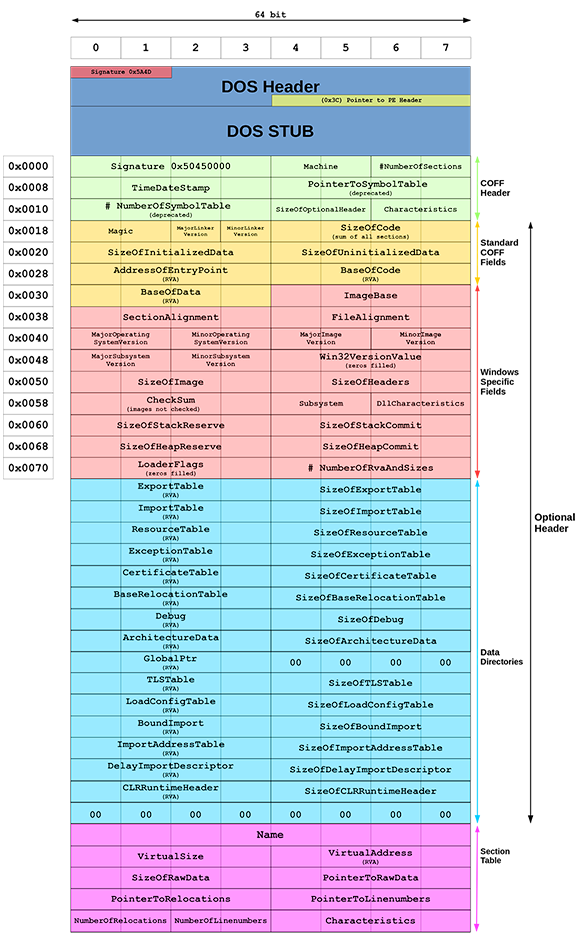

# Windows EXE 
## PE Layout Image

## DOS Header
| Addr |  Bytes | Description |
|------|--------|--------|
|0x0000| **4D 5A** 90 00 03 00 00 00 | Signature Field "MZ" | 
|0x0008| ... | |
|0x0038| 00 00 00 00 **80 00 00 00** | Pointer to PE Header |

#### Signature Field
Always `0x5A4D` (`"MZ"` in ASCII) - indicates the file is executable
#### Pointer to PE Header
Offset to the PE header from the beginning of file

## DOS Stub
Code to run if in a DOS environment. 

| Addr |  Bytes | Description |
|------|--------|--------|
|0x0040| ... | Typically prints "This program cannot be run in DOS mode" |

## PE Header

| Addr |  Bytes | Description |
|------|--------|--------|
|0x0080|50 45 00 004C 010F 00|PESignatureMachineNumberOfSections|
|0x0088|86 3D 8D 6600 D4 06 00|TimeDateStampPointerToSymbolTable|
|0x0090|0C 07 00 00E0 0007 01|NumberOfSymbolTableSizeOfOptionalHeaderCharacteristics|

#### PESignature
Always `0x00004550 "PE\0\0"`

#### Machine
Architecture of the machine, ie Intel, 32-bit, etc

| Bytes | Architecture |
| - | - |
| 0x014C | Intel 386 (32-bit) |
| 0x8664 | AMD 64 (64-bit) |
| 0x01C0 | ARM (32-bit) |
| 0xAA64 | ARM64 |

#### NumberOfSections
How many sections there are

#### TimeDateStamp
Build timestamp

#### PointerToSymbolTable
TODO

#### NumberOfSymbolTable
TODO

#### SizeOfOptionalHeader
Size in bytes of the optional header

#### Characteristics
Bit flags indicating properties such as DLL, executable, etc

## Optional Headers
- **Windows Specific Fields**
    - Go research it
- **Data Directories**
    - Go research it

## Section Table
- **Name**
    - Section name, 8-byte string
        - .text -> executable code
        - .data -> Initialized global/static variables
        - .rdata -> read-only data (strings, imports etc)
        - .bss -> unitialized data
        - .rsrc -> icons, images, etc
        - .reloc -> Base relocations for ASLR (Address Space Layout Randomization)
- **VirtualSize**
- **VirtualAddress**
    - Location to load into memory
- **SizeOfRawData**
    - Size of section
- **PointerToRawData**
    - Offset to section data
- **PointerToRelocations**
- **PointerToLineNumbers**
- **NumberOfRelocations**
- **NumberOfLineNumbers**
- **Characteristics**
